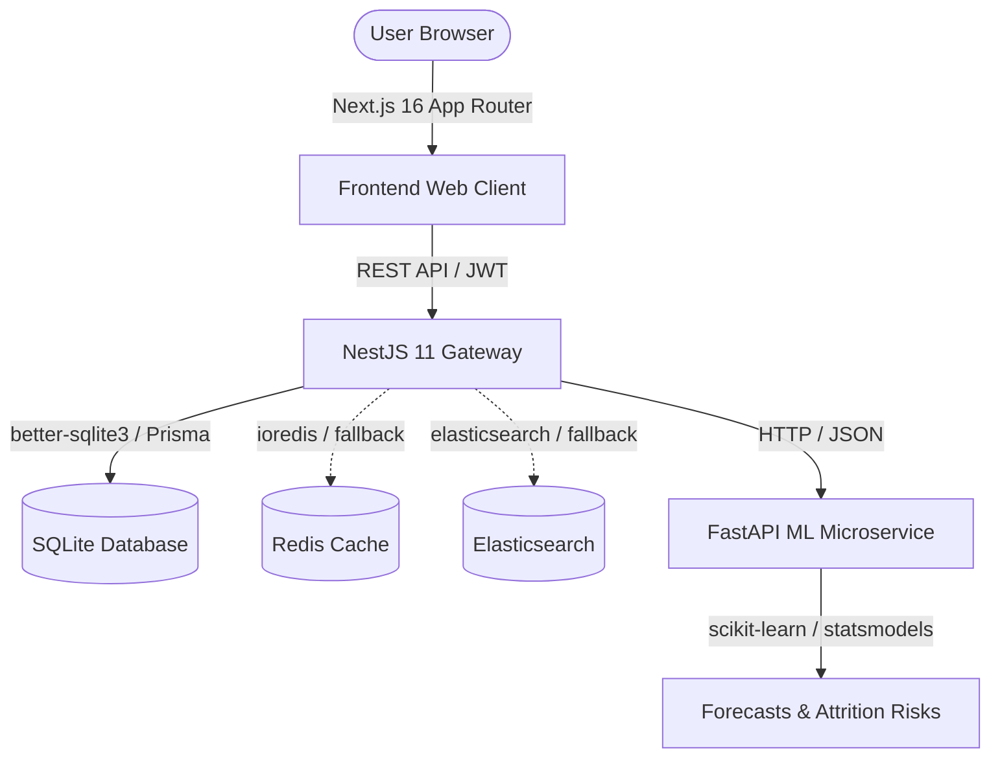

# AMDOX ERP SUITE

AMDOX ERP Suite is a production-grade, high-performance Enterprise Resource Planning (ERP) platform built with a cutting-edge 2026 technology stack. It provides real-time control, advanced telemetry, time-series operations logging, global search, simulated BullMQ background queues, fallback caching, and predictive AI insights for workforce retention and financial forecasts.

---

## 🏗️ Architecture Overview

The system is organized as a microservices and gateway architecture:



1. **Frontend (Next.js 16 + React 19 + Zustand + React Query)**: A responsive, glassmorphic dark-themed dashboard.
2. **Backend API Gateway (NestJS 11 + Prisma 7)**: Consolidates endpoints, handles authentication, roles, data validation, and telemetry.
3. **AI/ML Microservice (FastAPI + Python 3.11)**: Independent service using statistics and ML models for cash flow predictions and employee attrition risk.

---

## 🛠️ Technology Stack

| Category | Selected Technology | Role |
| :--- | :--- | :--- |
| **Frontend Framework** | Next.js 16 + React 19 + TypeScript | High performance SSR/SSG rendering and App Router. |
| **UI Library** | Tailwind CSS 4 + Lucide Icons | Premium glassmorphism dark-themed design system. |
| **State Management** | Zustand + React Query (TanStack v5) | Client state management and server state synchronization. |
| **Backend Runtime** | NestJS 11 + TypeScript | Highly structured backend architecture. |
| **ORM / Client** | Prisma 7.8 + SQLite Adapter | Database query client using native sqlite driver. |
| **Local Database** | SQLite (`dev.db` via `better-sqlite3`) | Zero-configuration local database (auto-seeded). |
| **AI / ML Services** | FastAPI + scikit-learn + statsmodels | Time-series forecasting and turnover classification. |
| **Caching** | Redis 8 (`ioredis`) | Cache layer (falls back to memory if offline). |
| **Observability** | Prometheus + Loki + Grafana | Scopes logging, telemetry, and system metrics. |
| **Infrastructure** | Docker + Terraform 1.9 | Containerization & AWS Infrastructure as Code (VPC, ALB, RDS, ECS). |

---

## 📁 Repository Structure

```text
├── backend/            # NestJS 11 Gateway & Prisma config
├── frontend/           # Next.js 16 Web Application
├── ml-service/         # FastAPI Python AI/ML microservice
├── infrastructure/     # Dockerfiles, Terraform scripts, and Prometheus config
└── README.md           # This project guide
```

---

## 🚀 Getting Started (Local Run Guide)

Follow these instructions to start the development servers on your machine.

### Prerequisites
* **Node.js** (v20.6+ recommended; v24 verified)
* **Python** (v3.10+; v3.11 verified)
* **Git**

---

### Step 1: Set up the AI/ML Microservice
1. Navigate to the `ml-service/` directory:
   ```bash
   cd ml-service
   ```
2. Create and activate a Python virtual environment:
   ```bash
   python -m venv .venv
   # Windows:
   .venv\Scripts\activate
   # Linux/macOS:
   source .venv/bin/activate
   ```
3. Install the dependencies:
   ```bash
   pip install -r requirements.txt
   ```
4. Start the FastAPI server on port 8000:
   ```bash
   uvicorn app.main:app --host 127.0.0.1 --port 8000
   ```

---

### Step 2: Set up the NestJS Backend
1. Navigate to the `backend/` directory:
   ```bash
   cd ../backend
   ```
2. Install the node packages:
   ```bash
   npm install
   ```
3. Generate the Prisma client & seed the SQLite database:
   ```bash
   npx prisma generate
   npx prisma db seed
   ```
4. Start the production backend server on port 5000:
   ```bash
   node --env-file=.env dist/src/main.js
   # Or start in watch/development mode:
   npm run start:dev
   ```

---

### Step 3: Set up the Next.js Frontend
1. Navigate to the `frontend/` directory:
   ```bash
   cd ../frontend
   ```
2. Install the node packages:
   ```bash
   npm install
   ```
3. Start the Next.js development server on port 3000:
   ```bash
   npm run dev
   ```

---

## 🔑 Login Credentials

Open your web browser and go to **[http://localhost:3000](http://localhost:3000)**.
Use the following pre-seeded credentials to log in:

* **Email**: `admin@amx.com`
* **Password**: `admin123`

---

## 🛡️ Core Features to Test

* **Dashboard Analytics**: Check live revenue/expense metrics and product graphs.
* **AI Predictions**: Verify that **AI Finance Forecast** (3-month projection) and **AI Retention Warning** (turnover risks) are populated by querying the FastAPI microservice.
* **Workforce Registry**: Manage employee profiles, departments, and salaries.
* **Attendance & Leaves**: Modify working logs and approve or reject leave requests.
* **Inventory Catalog**: Track stock levels with low-stock warning indicators (<= 10 units).
* **Finance Ledger**: Post cash transaction records (revenue and expenses).
